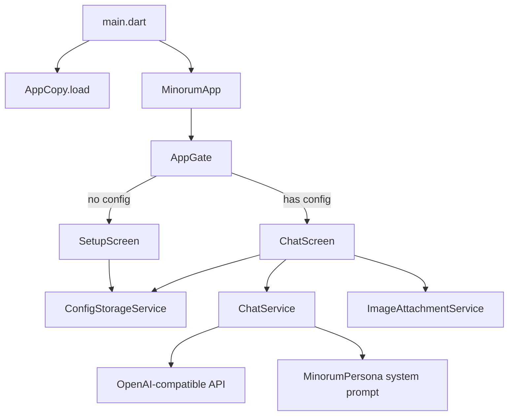

# Minorum — Project Brief (Web Development)

## 1. Ringkasan Produk

**Minorum** adalah client chat AI pribadi dengan persona hangat, casual, dan semi-blak-blakan (bahasa Indonesia sehari-hari). Aplikasi saat ini adalah **Flutter Android** yang terhubung ke **API OpenAI-compatible** (mis. 9Router self-hosted). Kredensial (URL, API key, model) disimpan **hanya di perangkat** — tidak ada backend bawaan.

| Aspek | Detail |
|-------|--------|
| **Nama** | Minorum |
| **Versi** | 1.0.0+1 |
| **Platform saat ini** | Android (API 21+) |
| **Target web** | Belum ada — brief ini untuk porting |
| **Bahasa UI** | Indonesia (casual) |
| **Tema** | Dark only, Material 3 |
| **Package** | `com.dealwithsign.minorum` |

---

## 2. Arsitektur Aplikasi



### Struktur folder

```
assets/
  copy/minorum_copy.json     # Semua string UI + suggestion chips
  fonts/Geist*.ttf           # Typography
  icon/x.jpeg                # Avatar/logo
lib/
  core/
    config/app_config.dart   # URL builder, validasi config
    copy/app_copy.dart       # Loader copy JSON
    persona/minorum_persona.dart  # System prompt
    theme/app_theme.dart     # Design tokens (sumber kebenaran)
    suggestions/suggestion_pool.dart
    link/                    # Linkify markdown + open external
  screens/                   # app_gate, setup, chat
  services/                  # chat, storage, parser, image
  widgets/                   # Komponen UI reusable
  models/message.dart
test/                        # Unit tests
```

### Alur pengguna

1. **First launch** → Setup: API URL, API Key, pilih model
2. **Test koneksi** wajib sukses sebelum submit
3. **Chat** → streaming SSE, markdown, gambar, ganti model, reset chat
4. **Empty state** → 3 suggestion chips random dari pool ~94 pertanyaan

---

## 3. Fitur Utama (untuk parity web)

| Fitur | Status Android | Catatan untuk Web |
|-------|----------------|-------------------|
| Setup API URL + Key + Model | ✅ | Ganti `flutter_secure_storage` → `localStorage` / `sessionStorage` / IndexedDB |
| Test koneksi (`GET /v1/models`) | ✅ | Sama |
| Streaming chat (`POST /v1/chat/completions`) | ✅ | `fetch` + `ReadableStream` / SSE parser |
| Vision (gambar base64) | ✅ | `<input type="file">` + FileReader |
| Markdown + link klik | ✅ | `react-markdown` / `marked` + linkify |
| Model picker (bottom sheet) | ✅ | Modal / drawer |
| Reset chat | ✅ | State in-memory saja |
| Suggestion chips | ✅ | Load dari JSON yang sama |
| Persona system prompt | ✅ | Port string dari `minorum_persona.dart` |
| Dark theme only | ✅ | CSS variables dari design tokens |

---

## 4. Integrasi API

### Endpoints (dari `AppConfig`)

```
POST {base}/v1/chat/completions   # stream: true
GET  {base}/v1/models
```

Base URL dinormalisasi: trailing slash dihapus, `/v1` ditambahkan jika belum ada.

### Request chat

```json
{
  "model": "auto",
  "stream": true,
  "messages": [
    { "role": "system", "content": "<MinorumPersona.systemPrompt>" },
    { "role": "user", "content": "..." },
    {
      "role": "user",
      "content": [
        { "type": "text", "text": "..." },
        { "type": "image_url", "image_url": { "url": "data:image/jpeg;base64,..." } }
      ]
    }
  ]
}
```

### SSE parsing

Parser memproses blok `data: {...}\n\n`, mengekstrak `choices[0].delta.content`. Retry: max 2x untuk error transient (network, server, timeout).

### Error handling

| Kind | HTTP | Pesan user (ID) |
|------|------|-----------------|
| auth | 401/403 | API key/URL salah |
| network | SocketException | Koneksi putus |
| server | 5xx | Server rewel |
| timeout | — | Kelamaan nunggu |
| cancelled | — | (silent) |

---

## 5. Library & Dependencies

### Flutter (saat ini)

| Package | Versi | Fungsi |
|---------|-------|--------|
| `flutter` | SDK | Framework |
| `http` | ^1.2.0 | HTTP + SSE streaming |
| `image_picker` | ^1.1.2 | Kamera/galeri |
| `flutter_markdown` | ^0.7.7+1 | Render markdown |
| `permission_handler` | ^11.3.1 | Izin kamera/galeri |
| `flutter_secure_storage` | ^9.2.4 | Simpan config aman |
| `line_icons` | ^2.0.3 | Ikon (Feather-style) |
| `url_launcher` | ^6.3.1 | Buka link eksternal |

### Rekomendasi stack Web

| Kategori | Rekomendasi | Alasan |
|----------|-------------|--------|
| **Framework** | React + Vite / Next.js / SvelteKit | Ekosistem matang, SSR opsional |
| **Styling** | Tailwind CSS + CSS variables | Mapping langsung dari design tokens |
| **Font** | `@fontsource/geist` atau self-host TTF | Match dengan Flutter |
| **Markdown** | `react-markdown` + `remark-gfm` | Parity dengan `flutter_markdown` |
| **HTTP/SSE** | Native `fetch` + custom SSE parser | Port logic dari `chat_stream_parser.dart` |
| **Storage** | `localStorage` (dev) / Web Crypto API | Ganti `flutter_secure_storage` |
| **Icons** | `react-icons/fi` (Feather) atau Line Icons web | Match `LineIcons.*` |
| **File upload** | `<input type="file" accept="image/*">` | Ganti `image_picker` |

---

## 6. Design Tokens

Sumber: `lib/core/theme/app_theme.dart`. Untuk web, ekspor sebagai CSS custom properties.

### 6.1 Colors

```css
:root {
  /* Background & Surface */
  --color-background: #000000;
  --color-surface: #0A0A0A;
  --color-surface-raised: #141414;
  --color-border: #1A1A1A;
  --color-border-subtle: #121212;

  /* Text */
  --color-text-primary: #FFFFFF;
  --color-text-secondary: #A1A1A1;
  --color-text-muted: #707070;
  --color-text-on-accent: #000000;

  /* Accent & Interactive */
  --color-accent-primary: #FFFFFF;
  --color-focus-ring: #0070F3;

  /* Semantic */
  --color-success: #2ECC71;
  --color-warning: #F5A623;
  --color-error: #FF4D4F;

  /* Disabled */
  --color-disabled-bg: #1A1A1A;
  --color-disabled-text: #4D4D4D;

  /* Overlay / Splash */
  --color-splash: rgba(255, 255, 255, 0.08);
  --color-highlight: rgba(255, 255, 255, 0.08);
  --color-focus-overlay: rgba(0, 112, 243, 0.08);
  --color-pressed-overlay: rgba(255, 255, 255, 0.12);
  --color-hover-overlay: rgba(255, 255, 255, 0.06);
}
```

### 6.2 Typography

| Token | Font | Size | Weight | Line Height | Letter Spacing |
|-------|------|------|--------|-------------|----------------|
| `displayLarge` | Geist | 32px | 500 | 1.15 | -1.28px |
| `titleLarge` | Geist | 24px | 500 | 1.2 | -0.48px |
| `titleSmall` | Geist | 20px | 500 | 1.25 | 0 |
| `titleMedium` | Geist | 17px | 500 | 1.3 | 0 |
| `bodyLarge` | Geist | 15px | 400 | 1.5 | 0 |
| `bodyMedium` | Geist | 13px | 400 | 1.4 | 0 |
| `labelLarge` | Geist | 15px | 500 | 1.5 | 0 |
| `labelSmall` | Geist | 11px | 400 | 1.3 | 0 |
| **Mono** | Geist Mono | — | 400/500 | — | Code blocks |

```css
:root {
  --font-sans: 'Geist', system-ui, sans-serif;
  --font-mono: 'Geist Mono', ui-monospace, monospace;
}
```

### 6.3 Spacing

```css
:root {
  --spacing-xs: 4px;
  --spacing-sm: 8px;
  --spacing-md: 12px;
  --spacing-lg: 16px;
  --spacing-xl: 24px;
  --spacing-xxl: 32px;
  --spacing-field-y: 12px;
}
```

### 6.4 Border Radius

Semua komponen pill menggunakan **16px** (chip, bubble, card, input, field, sheet top).

```css
:root {
  --radius-standard: 16px;
  --radius-sheet-top: 16px 16px 0 0;
}
```

### 6.5 Layout

```css
:root {
  --header-height: 56px;
  --button-height: 48px;
  --field-min-height: 48px;
  --icon-button-size: 44px;
  --icon-size: 20px;
  --avatar-size: 56px;
  --border-width: 1px;
  --field-padding-x: 14px;
  --content-inset: 16px;
  --user-bubble-max-width: 82%; /* dari lebar area chat */
  --chat-image-preview: 64px;
  --chat-image-bubble: 136px;
  --sheet-drag-handle-height: 24px;
}
```

### 6.6 Shadows

```css
:root {
  --shadow-floating: 0 4px 16px rgba(0, 0, 0, 0.5);
  --shadow-modal: 0 8px 32px rgba(0, 0, 0, 0.6);
}
```

### 6.7 Komponen patterns

| Komponen | Style |
|----------|-------|
| **PillAction** | `surface` (default) atau `primary` (CTA), border `border-subtle`, radius 16px, min-height 48px |
| **PillInputContainer** | Surface bg, border subtle, radius 16px |
| **User bubble** | `accent-primary` bg, `text-on-accent`, align right, max 82% |
| **Assistant bubble** | `surface` bg, border subtle, align left, full width |
| **Link di markdown** | `focus-ring` (#0070F3) |
| **Send button** | Filled white saat aktif, `disabled-bg` saat nonaktif |
| **Bottom sheet** | Surface, drag handle, border top radius 16px |
| **Snackbar** | `surface-raised`, floating, border subtle |

---

## 7. Inventori Komponen UI

| Widget Flutter | Fungsi | Equivalent Web |
|----------------|--------|----------------|
| `ScreenHeader` | Header 56px + safe area | `<header>` fixed |
| `ScreenBottomBar` | Input bar + border top | `<footer>` sticky |
| `ScreenIntro` | Avatar + title + subtitle | Hero section |
| `PillAction` | Button/chip pill | `<button class="pill">` |
| `PillInputContainer` | Wrapper input pill | Input group |
| `ChatBubble` | User/assistant message | Message component |
| `ChatMarkdown` | Markdown renderer | `react-markdown` |
| `TypingIndicator` | Loading dots | CSS animation |
| `ActionBottomSheet` | Konfirmasi reset | Modal |
| `ModelPickerSheet` | Pilih model | Modal list |
| `AttachImageSheet` | Kamera/galeri | File picker modal |
| `ChatImage` | Preview gambar | `` rounded |
| `AppSnackBar` | Toast error/success | Toast component |

### Ikon yang dipakai (Line Icons → Feather equivalent)

- `expand_more` — dropdown model
- `plus` — new chat
- `image` — attach
- `arrowUp` — send
- `timesCircle` — remove preview
- `eye` / `eyeSlash` — toggle API key
- `link` — test connection

---

## 8. Konten & Copy

File: `assets/copy/minorum_copy.json` — **gunakan file yang sama** di web.

Sections:

- `app_meta`, `setup_screen`, `chat_screen_empty_state`
- `chat_screen_input_header`, `chat_screen_reset_bottom_sheet`
- `pilih_model_bottom_sheet`, `upload_gambar_bottom_sheet`
- `error_and_snackbar_messages`, `internal_not_directly_shown`
- `suggestion_chips` (94 chips: `original_44` + `new_50_random_mix`)

Tone: casual Indonesia, tidak formal.

---

## 9. Persona AI

File: `lib/core/persona/minorum_persona.dart` — system prompt ~80 baris.

Karakteristik:

- Hangat, casual, semi-blak-blakan/sassy
- Adaptif: santai vs serius
- Larangan klise CS/robot
- Format output adaptif (prosa vs bullet)
- Link wajib markdown `[teks](url)`
- Tidak menyebut diri sebagai "AI"
- Batasan keras: no SARA, body shaming, concern-trolling

---

## 10. Rekomendasi Implementasi Web

### Prioritas MVP

1. **Setup screen** + localStorage config
2. **Chat screen** dengan SSE streaming
3. **Design tokens** sebagai CSS variables (dark only)
4. **Markdown** + link external
5. **Model picker** + test connection
6. **Suggestion chips** dari JSON

### Prioritas fase 2

- Upload gambar (vision API)
- Responsive layout (mobile-first, max-width chat ~768px desktop)
- PWA (offline shell, installable)
- Settings: edit/hapus config

### Pertimbangan keamanan web

- API key di browser = **risiko XSS**. Pertimbangkan:
  - Proxy backend (BFF) yang menyimpan key server-side, atau
  - User self-hosted (sama seperti mobile) dengan disclaimer jelas
- CORS: API harus allow origin web app
- Jangan commit API key ke repo

### Layout responsif

```
Mobile (<768px):  Full width, content inset 16px
Desktop (≥768px): Max-width ~720px centered, atau sidebar untuk settings
```

---

## 11. File yang Bisa Di-reuse Langsung

| Asset / Logic | Path | Reuse |
|---------------|------|-------|
| Copy JSON | `assets/copy/minorum_copy.json` | ✅ 100% |
| Persona prompt | `lib/core/persona/minorum_persona.dart` | ✅ Copy string |
| Design tokens | `lib/core/theme/app_theme.dart` | ✅ Export ke CSS |
| SSE parser logic | `lib/services/chat_stream_parser.dart` | ✅ Port ke TS |
| API error classification | `lib/services/chat_api_error.dart` | ✅ Port ke TS |
| Fonts Geist | `assets/fonts/` | ✅ Self-host |
| Avatar | `assets/icon/x.jpeg` | ✅ |

---

## 12. Referensi Kode Sumber

| Area | File utama |
|------|------------|
| Entry point | `lib/main.dart` |
| Routing / gate | `lib/screens/app_gate.dart` |
| Setup | `lib/screens/setup_screen.dart` |
| Chat | `lib/screens/chat_screen.dart` |
| API client | `lib/services/chat_service.dart` |
| SSE parser | `lib/services/chat_stream_parser.dart` |
| Error handling | `lib/services/chat_api_error.dart` |
| Config storage | `lib/services/config_storage_service.dart` |
| Image attach | `lib/services/image_attachment_service.dart` |
| Design system | `lib/core/theme/app_theme.dart` |
| UI copy | `lib/core/copy/app_copy.dart` + `assets/copy/minorum_copy.json` |
| Persona | `lib/core/persona/minorum_persona.dart` |

---

## 13. `tokens.css` (siap pakai)

Salin ke `web/src/styles/tokens.css` (atau `app/globals.css`) dan import di entry point.

```css
/* Minorum Design Tokens — dari lib/core/theme/app_theme.dart */

:root {
  /* Colors — Background & Surface */
  --color-background: #000000;
  --color-surface: #0a0a0a;
  --color-surface-raised: #141414;
  --color-border: #1a1a1a;
  --color-border-subtle: #121212;

  /* Colors — Text */
  --color-text-primary: #ffffff;
  --color-text-secondary: #a1a1a1;
  --color-text-muted: #707070;
  --color-text-on-accent: #000000;

  /* Colors — Accent & Interactive */
  --color-accent-primary: #ffffff;
  --color-focus-ring: #0070f3;

  /* Colors — Semantic */
  --color-success: #2ecc71;
  --color-warning: #f5a623;
  --color-error: #ff4d4f;

  /* Colors — Disabled */
  --color-disabled-bg: #1a1a1a;
  --color-disabled-text: #4d4d4d;

  /* Colors — Overlay */
  --color-splash: rgba(255, 255, 255, 0.08);
  --color-highlight: rgba(255, 255, 255, 0.08);
  --color-focus-overlay: rgba(0, 112, 243, 0.08);
  --color-pressed-overlay: rgba(255, 255, 255, 0.12);
  --color-hover-overlay: rgba(255, 255, 255, 0.06);

  /* Typography */
  --font-sans: 'Geist', system-ui, -apple-system, sans-serif;
  --font-mono: 'Geist Mono', ui-monospace, 'Cascadia Code', monospace;

  --text-display-large-size: 32px;
  --text-display-large-weight: 500;
  --text-display-large-line-height: 1.15;
  --text-display-large-letter-spacing: -1.28px;

  --text-title-large-size: 24px;
  --text-title-large-weight: 500;
  --text-title-large-line-height: 1.2;
  --text-title-large-letter-spacing: -0.48px;

  --text-title-small-size: 20px;
  --text-title-small-weight: 500;
  --text-title-small-line-height: 1.25;

  --text-title-medium-size: 17px;
  --text-title-medium-weight: 500;
  --text-title-medium-line-height: 1.3;

  --text-body-large-size: 15px;
  --text-body-large-weight: 400;
  --text-body-large-line-height: 1.5;

  --text-body-medium-size: 13px;
  --text-body-medium-weight: 400;
  --text-body-medium-line-height: 1.4;

  --text-label-large-size: 15px;
  --text-label-large-weight: 500;
  --text-label-large-line-height: 1.5;

  --text-label-small-size: 11px;
  --text-label-small-weight: 400;
  --text-label-small-line-height: 1.3;

  /* Spacing */
  --spacing-xs: 4px;
  --spacing-sm: 8px;
  --spacing-md: 12px;
  --spacing-lg: 16px;
  --spacing-xl: 24px;
  --spacing-xxl: 32px;
  --spacing-field-y: 12px;

  /* Radius */
  --radius-standard: 16px;
  --radius-sheet-top: 16px 16px 0 0;

  /* Layout */
  --header-height: 56px;
  --button-height: 48px;
  --field-min-height: 48px;
  --icon-button-size: 44px;
  --icon-size: 20px;
  --avatar-size: 56px;
  --border-width: 1px;
  --field-padding-x: 14px;
  --content-inset: 16px;
  --user-bubble-max-width: 82%;
  --chat-image-preview: 64px;
  --chat-image-bubble: 136px;
  --sheet-drag-handle-height: 24px;
  --chat-max-width: 720px;

  /* Shadows */
  --shadow-floating: 0 4px 16px rgba(0, 0, 0, 0.5);
  --shadow-modal: 0 8px 32px rgba(0, 0, 0, 0.6);
}

/* Base reset (opsional) */
*,
*::before,
*::after {
  box-sizing: border-box;
}

body {
  margin: 0;
  font-family: var(--font-sans);
  font-size: var(--text-body-large-size);
  font-weight: var(--text-body-large-weight);
  line-height: var(--text-body-large-line-height);
  color: var(--color-text-primary);
  background-color: var(--color-background);
  -webkit-font-smoothing: antialiased;
}

/* Utility classes umum */
.text-title-small {
  font-size: var(--text-title-small-size);
  font-weight: var(--text-title-small-weight);
  line-height: var(--text-title-small-line-height);
}

.text-body-medium {
  font-size: var(--text-body-medium-size);
  font-weight: var(--text-body-medium-weight);
  line-height: var(--text-body-medium-line-height);
  color: var(--color-text-secondary);
}

.pill {
  display: flex;
  align-items: center;
  justify-content: center;
  min-height: var(--field-min-height);
  padding: var(--spacing-field-y) var(--field-padding-x);
  border-radius: var(--radius-standard);
  border: var(--border-width) solid var(--color-border-subtle);
  background-color: var(--color-surface);
  color: var(--color-text-primary);
  font-size: var(--text-body-large-size);
  cursor: pointer;
  transition: background-color 0.15s ease;
}

.pill:hover:not(:disabled) {
  background-color: var(--color-surface-raised);
}

.pill--primary {
  background-color: var(--color-accent-primary);
  color: var(--color-text-on-accent);
  border-color: var(--color-border-subtle);
}

.pill:disabled {
  opacity: 0.45;
  cursor: not-allowed;
}
```

---

## 14. `tokens.json` (Style Dictionary / Tailwind)

Salin ke `web/tokens.json` untuk tooling (Style Dictionary, Tailwind `theme.extend`, Figma Tokens).

```json
{
  "color": {
    "background": { "value": "#000000" },
    "surface": { "value": "#0A0A0A" },
    "surface-raised": { "value": "#141414" },
    "border": { "value": "#1A1A1A" },
    "border-subtle": { "value": "#121212" },
    "text-primary": { "value": "#FFFFFF" },
    "text-secondary": { "value": "#A1A1A1" },
    "text-muted": { "value": "#707070" },
    "text-on-accent": { "value": "#000000" },
    "accent-primary": { "value": "#FFFFFF" },
    "focus-ring": { "value": "#0070F3" },
    "success": { "value": "#2ECC71" },
    "warning": { "value": "#F5A623" },
    "error": { "value": "#FF4D4F" },
    "disabled-bg": { "value": "#1A1A1A" },
    "disabled-text": { "value": "#4D4D4D" }
  },
  "font": {
    "sans": { "value": "'Geist', system-ui, sans-serif" },
    "mono": { "value": "'Geist Mono', ui-monospace, monospace" }
  },
  "fontSize": {
    "display-large": { "value": "32px" },
    "title-large": { "value": "24px" },
    "title-small": { "value": "20px" },
    "title-medium": { "value": "17px" },
    "body-large": { "value": "15px" },
    "body-medium": { "value": "13px" },
    "label-large": { "value": "15px" },
    "label-small": { "value": "11px" }
  },
  "fontWeight": {
    "regular": { "value": "400" },
    "medium": { "value": "500" }
  },
  "lineHeight": {
    "display-large": { "value": "1.15" },
    "title-large": { "value": "1.2" },
    "title-small": { "value": "1.25" },
    "title-medium": { "value": "1.3" },
    "body-large": { "value": "1.5" },
    "body-medium": { "value": "1.4" },
    "label-large": { "value": "1.5" },
    "label-small": { "value": "1.3" }
  },
  "letterSpacing": {
    "display-large": { "value": "-1.28px" },
    "title-large": { "value": "-0.48px" }
  },
  "spacing": {
    "xs": { "value": "4px" },
    "sm": { "value": "8px" },
    "md": { "value": "12px" },
    "lg": { "value": "16px" },
    "xl": { "value": "24px" },
    "xxl": { "value": "32px" },
    "field-y": { "value": "12px" }
  },
  "borderRadius": {
    "standard": { "value": "16px" }
  },
  "size": {
    "header-height": { "value": "56px" },
    "button-height": { "value": "48px" },
    "field-min-height": { "value": "48px" },
    "icon-button": { "value": "44px" },
    "icon": { "value": "20px" },
    "avatar": { "value": "56px" },
    "field-padding-x": { "value": "14px" },
    "content-inset": { "value": "16px" },
    "chat-image-preview": { "value": "64px" },
    "chat-image-bubble": { "value": "136px" },
    "chat-max-width": { "value": "720px" }
  },
  "borderWidth": {
    "default": { "value": "1px" }
  },
  "boxShadow": {
    "floating": { "value": "0 4px 16px rgba(0, 0, 0, 0.5)" },
    "modal": { "value": "0 8px 32px rgba(0, 0, 0, 0.6)" }
  }
}
```

### Contoh mapping Tailwind (`tailwind.config.ts`)

```ts
import tokens from './tokens.json';

export default {
  theme: {
    extend: {
      colors: {
        background: tokens.color.background.value,
        surface: tokens.color.surface.value,
        'surface-raised': tokens.color['surface-raised'].value,
        'border-subtle': tokens.color['border-subtle'].value,
        'text-primary': tokens.color['text-primary'].value,
        'text-secondary': tokens.color['text-secondary'].value,
        'text-muted': tokens.color['text-muted'].value,
        'focus-ring': tokens.color['focus-ring'].value,
        error: tokens.color.error.value,
      },
      fontFamily: {
        sans: tokens.font.sans.value.split(',').map((f) => f.trim().replace(/'/g, '')),
        mono: tokens.font.mono.value.split(',').map((f) => f.trim().replace(/'/g, '')),
      },
      borderRadius: {
        pill: tokens.borderRadius.standard.value,
      },
      spacing: {
        xs: tokens.spacing.xs.value,
        sm: tokens.spacing.sm.value,
        md: tokens.spacing.md.value,
        lg: tokens.spacing.lg.value,
        xl: tokens.spacing.xl.value,
        xxl: tokens.spacing.xxl.value,
      },
      maxWidth: {
        chat: tokens.size['chat-max-width'].value,
      },
    },
  },
};
```

---

## 15. Scaffold Web (React + Vite)

Struktur folder yang mirror arsitektur Flutter. Rekomendasi: **React 19 + Vite + TypeScript**.

### Struktur direktori

```
web/
├── public/
│   ├── fonts/                  # Copy dari assets/fonts/
│   └── icon/x.jpeg             # Copy dari assets/icon/
├── src/
│   ├── main.tsx                # Entry (≈ main.dart)
│   ├── App.tsx                 # Root + routing (≈ MinorumApp)
│   ├── assets/
│   │   └── copy/
│   │       └── minorum_copy.json   # Symlink/copy dari assets/copy/
│   ├── core/
│   │   ├── config/
│   │   │   └── app-config.ts      # ≈ app_config.dart
│   │   ├── copy/
│   │   │   └── app-copy.ts        # ≈ app_copy.dart
│   │   ├── persona/
│   │   │   └── minorum-persona.ts  # ≈ minorum_persona.dart
│   │   ├── suggestions/
│   │   │   └── suggestion-pool.ts  # ≈ suggestion_pool.dart
│   │   └── link/
│   │       ├── linkify-markdown.ts
│   │       └── open-external-link.ts
│   ├── models/
│   │   └── message.ts              # ≈ message.dart
│   ├── services/
│   │   ├── chat-service.ts         # ≈ chat_service.dart
│   │   ├── chat-stream-parser.ts   # ≈ chat_stream_parser.dart
│   │   ├── chat-api-error.ts       # ≈ chat_api_error.dart
│   │   ├── config-storage-service.ts
│   │   └── image-attachment-service.ts
│   ├── screens/
│   │   ├── app-gate.tsx            # ≈ app_gate.dart
│   │   ├── setup-screen.tsx        # ≈ setup_screen.dart
│   │   └── chat-screen.tsx         # ≈ chat_screen.dart
│   ├── components/
│   │   ├── screen-chrome.tsx
│   │   ├── pill-action.tsx
│   │   ├── pill-input-container.tsx
│   │   ├── chat-bubble.tsx
│   │   ├── chat-markdown.tsx
│   │   ├── typing-indicator.tsx
│   │   ├── action-bottom-sheet.tsx
│   │   ├── model-picker-sheet.tsx
│   │   ├── attach-image-sheet.tsx
│   │   ├── chat-image.tsx
│   │   └── app-snackbar.tsx
│   └── styles/
│       ├── tokens.css              # Dari section 13
│       └── global.css
├── tokens.json                     # Dari section 14
├── index.html
├── package.json
├── tsconfig.json
└── vite.config.ts
```

### Bootstrap command

```bash
npm create vite@latest web -- --template react-ts
cd web
npm install react-markdown remark-gfm react-icons
```

### `package.json` dependencies (target)

```json
{
  "dependencies": {
    "react": "^19.0.0",
    "react-dom": "^19.0.0",
    "react-markdown": "^9.0.0",
    "remark-gfm": "^4.0.0",
    "react-icons": "^5.0.0"
  },
  "devDependencies": {
    "@types/react": "^19.0.0",
    "@types/react-dom": "^19.0.0",
    "@vitejs/plugin-react": "^4.0.0",
    "typescript": "^5.0.0",
    "vite": "^6.0.0"
  }
}
```

### Routing sederhana (tanpa router library)

Mirror `AppGate` — cukup state di `App.tsx`:

```tsx
// App.tsx — pola AppGate
function App() {
  const [config, setConfig] = useState<AppConfig | null>(null);
  const [loading, setLoading] = useState(true);

  useEffect(() => {
    configStorage.loadConfig().then((c) => {
      setConfig(c);
      setLoading(false);
    });
    appCopy.load();
  }, []);

  if (loading) return <LoadingSpinner />;
  if (!config) return <SetupScreen onComplete={setConfig} />;
  return <ChatScreen config={config} />;
}
```

### Port priority per file

| Urutan | File TS | Sumber Dart | Prioritas |
|--------|---------|-------------|-----------|
| 1 | `app-config.ts` | `app_config.dart` | MVP |
| 2 | `config-storage-service.ts` | `config_storage_service.dart` | MVP |
| 3 | `chat-api-error.ts` | `chat_api_error.dart` | MVP |
| 4 | `chat-stream-parser.ts` | `chat_stream_parser.dart` | MVP |
| 5 | `chat-service.ts` | `chat_service.dart` | MVP |
| 6 | `app-copy.ts` | `app_copy.dart` | MVP |
| 7 | `minorum-persona.ts` | `minorum_persona.dart` | MVP |
| 8 | `suggestion-pool.ts` | `suggestion_pool.dart` | MVP |
| 9 | `setup-screen.tsx` | `setup_screen.dart` | MVP |
| 10 | `chat-screen.tsx` | `chat_screen.dart` | MVP |
| 11 | `chat-markdown.tsx` | `chat_markdown.dart` | MVP |
| 12 | `image-attachment-service.ts` | `image_attachment_service.dart` | Fase 2 |

### Catatan implementasi

- **Storage key** (sama dengan Flutter): `api_base_url`, `api_key`, `model_name`
- **SSE**: gunakan `fetch` + `response.body.getReader()` + `TextDecoder`, port logic dari `chat_stream_parser.dart`
- **Gambar**: resize max 1536px, quality 85% (match `image_attachment_service.dart`) sebelum base64
- **Font**: self-host dari `assets/fonts/`, definisikan `@font-face` di `global.css`
- **CORS**: pastikan API backend allow origin web app sebelum deploy
